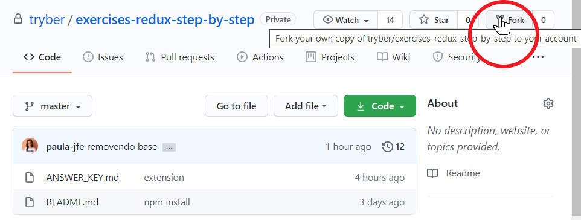
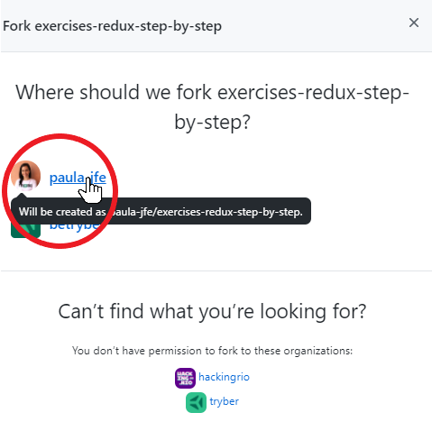
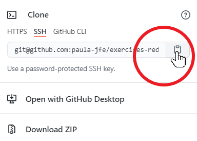

## Compreendendo os momentos de cada método de ciclo de vida do React

### Para fazer um fork

**1 - Clique no botão "Fork" do repositório.**



**2 - Selecione seu usuário do GitHub.**



**3 - Escolha a URL remota (SSH, HTTPS) para fazer o clone do repositório.**



### Instruções (Idênticas às da plataforma do curso)

Você receberá trechos do código de uma aplicação e deverá encaixar e adaptar esse código de acordo com o método correspondente. **Para isso você receberá dicas sobre qual é o método responsável pela execução do código, e qual o componente que precisará desse código.** Alinhamentos feitos? Let's code!

##### Dentro da master
```javascript
cd lifecycleapp
npm install
npm start
```

##### src/App.js
*O método que você procura é o primeiro método a ser executado. Ele é executado uma única vez quando o componente é inicializado e guarda os estados iniciais do componente. Recebe props como argumento e é onde conectamos as funções ao componente (bind).*
```javascript
super();
this.state = {
  showProfile: true,
};

this.changeProfile = this.changeProfile.bind(this);
```

##### src/App.js
*O método que você busca é executado toda vez que um estado for atualizado ou toda vez que uma prop for atualizada. É executado várias vezes durante a vida útil do componente e é um método puro. Um método puro não tem efeitos colaterais, sua saída será sempre igual para uma mesma entrada. Ou seja: não se deve utilizar setState dentro deste método, porque isso seria um efeito colateral.*
```javascript
const { showProfile } = this.state;

return (
  <div className="gitNetwork d-flex flex-column justify-content-center">
    { showProfile ? <Profile /> : null }
    <div className="central d-flex justify-content-center">
      <button
        className="btn btn-dark align-self-center"
        type="button"
        onClick={ this.changeProfile }
      >
        Mostrar / Ocultar Perfil
      </button>
    </div>
  <Connections />
</div>
);
```

##### src/components/Profile.js
*O método que você busca é executado assim que o componente for montado e estiver pronto na tela. Se você fará uma requisição a alguma API, esse método é um bom lugar para realizar tal requisição. O React permite o uso do setState nesse método.*
```javascript
const myUser = ''; // Preencha myUser com o seu user do GitHub.

try {
  const url = `https://api.github.com/users/${myUser}`;
  const response = await fetch(url);
  const dataJson = await response.json();
  this.changeDataJson(dataJson);
} catch (error) {
  console.log(error);
}
```

##### src/components/Connections.js
*O método aqui é muito útil quando você não quer que a sua atualização de estado ou props gere uma nova renderização. Ele, portanto, é executado antes do método componentDidUpdate. O componentDidUpdate não será chamado se esse método retornar false. Recebe como parâmetros nextProps e nextState.*
```javascript
const maxContactsNumber = 3;

return list.length <= maxContactsNumber;
// A quantidade de contatos não pode ser maior que 3, portanto se a lista é maior que 3, ele deverá retornar false e impedir a atualização.
```

##### src/components/Connections.js
*Método executado sempre que ocorrer alguma atualização. Comumente utilizado para atualizar o DOM de acordo com as alterações de estado ou props, e é um método que também pode ser utilizado para requisições à API. Recebe como parâmetros prevProps, prevState e snapshot, sendo os mais utilizados os dois primeiros.*
```javascript
const { list } = this.state;

if (prevState.list.length < list.length) {
  this.changeToBlue();
  // Ao adicionar um contato, a div ficará azul.
} else if (prevState.list.length > list.length) {
  this.changeToCoral();
  // Ao deletar um contato, a div ficará coral.
}
```

##### src/components/Profile.js
*Aqui você busca o método executado no momento anterior a completa desmontagem, destruição, do componente. Qualquer limpeza pode ser realizada neste método, seja cancelar a chamada de uma API, limpar localStorage ou parar a atualização de algum timer. Não se deve utilizar o setState nesse método, uma vez que o componente será destruído e, portanto, não ocorrerá uma nova atualização de estado nesse componente.*
```javascript
alert('Você ocultou seu perfil');
```

**Agora que você terminou a sua aplicação, você deve verificar que tudo está funcionando de acordo com o planejado. Para isso, selecionamos esta lista de celebridades do mundo da tecnologia que possuem um perfil no GitHub, para serem incluídos e incluídas na sua lista VIP de contatos:**

- **Sandi Metz (skmetz)** - Desenvolvedora de software e autora, especialista em código orientado a objetos em Ruby on Rails.
- **Anders Hejlsberg (ahejlsberg)** - Desenvolvedor do Delphi e Turbo Pascal.
- **Brendan Gregg (brendangregg)** - Engenheiro de núcleo e desempenho da Netflix.
- **Guido van Rossum (gvanrossum)** - Autor da linguagem de programação Python.
- **Yukihiro Matsumoto (matz)** - Criador da linguagem de programação Ruby,
- **Brendan Eich (BrendanEich)** - Criador da linguagem de programação JavaScript.
- **Markus Persson (xNotch)** - Fundador da Mojang Studios e criador do jogo Minecraft.
- **Natalie Weizenbaum (nex3)** - principal desenvolvedora e designer líder do Sass.

#### Verifique:
- Os dados do seu perfil GitHub foram exibidos ao iniciar a aplicação?
- É possível exibir ou ocultar os dados do seu perfil?
- É possível adicionar um contato na sua lista de contatos?
- Ao adicionar o contato, o background mudou para um tom azulado?
- É possível excluir um contato na sua lista de contatos?
- Ao excluir o contato, o background mudou para um tom alaranjado?
- O contador de contatos funciona perfeitamente?

**Se você respondeu *SIM* para todas as perguntas acima, você acabou de completar uma aplicação com todos os métodos comuns de ciclo de vida do React. Parabéns!**

#### Gabarito
*O gabarito do exercício está na pasta **answer_keys** desse repositório.*
